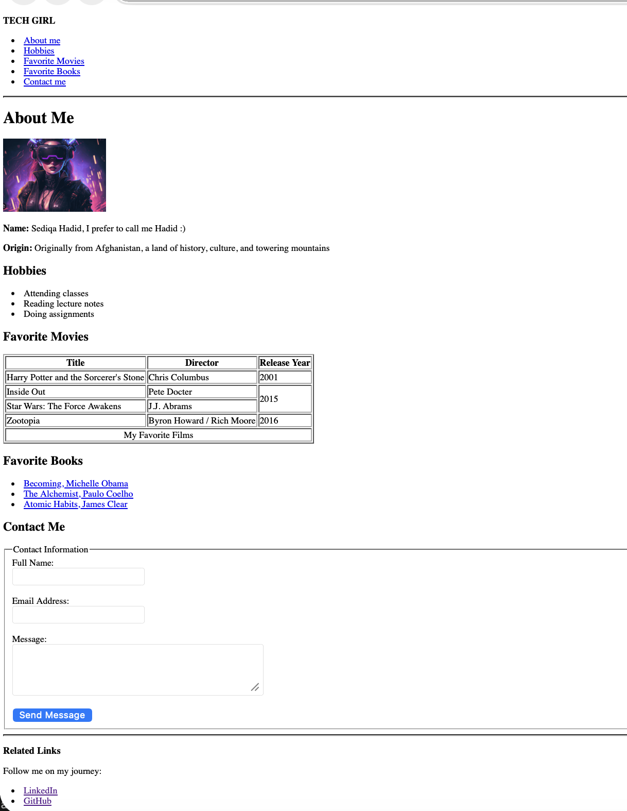
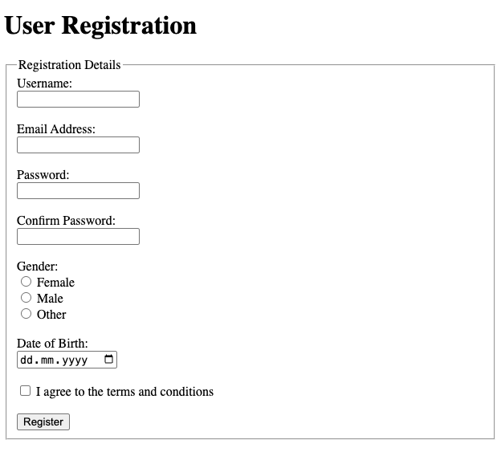

# University Web Engineering Course

In this repository, I would like to **share previews of my hands-on activities** from the Web Engineering course to **document my learning journey**.  

---

##  About Me Page

I developed a comprehensive **About Me** page to practice fundamental HTML concepts and advanced semantic layouts.

**Technical Updates & Features:**
* **Semantic HTML5 Structure:** Organized the page using `<header>`, `<nav>`, `<main>`, `<aside>`, and `<footer>` for improved accessibility and document flow.
* **Navigation Bar:** Implemented a functional menu within the `<nav>` tag to allow users to jump to specific sections (Hobbies, Movies, Contact).
* **Complex Data Tables:** Created a "Favorite Movies" table using `<thead>`, `<tbody>`, and `<tfoot>`. I practiced advanced attributes like `rowspan` (to group movies by release year) and `colspan` (for the table footer).
* **Media & Links:** Integrated a personal profile image and used an `<aside>` section for external social media links (LinkedIn, GitHub).
* **Contact Form:** Built a functional form using the `POST` method, featuring a `fieldset` and `legend` for clean data grouping.

**Preview:**

  
*Screenshot of my updated About Me page featuring a semantic layout and movie data table.*

---

##  Registration Form

In this task, I implemented a **User Registration Form** to master data collection and validation:
* **HTML5 Input Types:** Utilized `text`, `email`, `password`, `date`, `color`, `radio`, and `checkbox`.
* **Form Validation:** Applied the `required` attribute and `novalidate` logic to test browser-side validation.
* **Accessibility:** Paired `<label>` tags with input IDs to ensure the form is screen-reader friendly.

**Preview:**

  
*Screenshot of the registration form showing various input types and semantic grouping.*

---