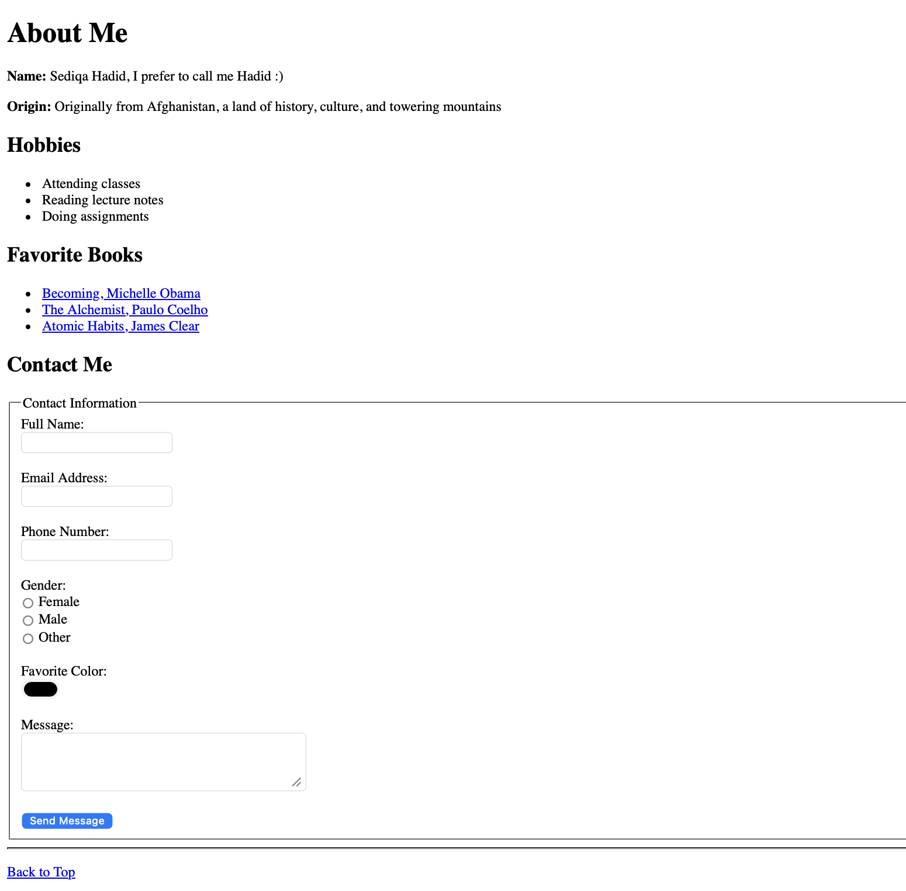

# University Web Engineering Course

In this repository, I would like to **share previews of my hands-on activities** from the Web Engineering course to **document my learning journey**.  

##  About Me Page

We were asked to build a very basic **About Me** page to practice fundamental HTML concepts.

Features include:  
- My name, origin, and hobbies  
- Favorite books with external links  
- Contact section with a form  
- Smooth navigation with “Back to Top” link  

**Preview:**

  
*Screenshot of my About Me page showing hobbies, books, and contact form.*

---

##  Registration Form

As a new task, I implemented a **User Registration Form** to practice:  
- HTML5 input types (`text`, `email`, `password`, `date`, `color`, `radio`, `checkbox`)  
- Semantic grouping with `<fieldset>` and `<legend>`  
- Form validation with `required` fields  
- Structured layout for accessibility  

Features include:  
- Username, Email, Password & Confirm Password  
- Gender selection (single choice)  
- Date of Birth  
- Terms & Conditions checkbox  
- Submit button  

**Preview:**

  
*Screenshot of the registration form with fieldset and all input fields.*

---